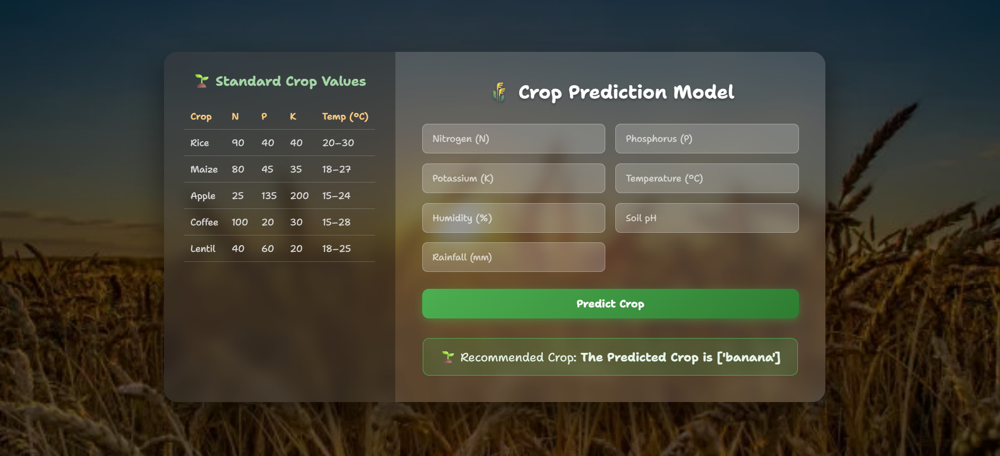

# Crop Prediction ML (Flask)

- Predicts the best crop based on soil nutrients and weather inputs
- Flask web UI with a sidebar of standard crop values
- Trained RandomForest model saved as a pickle for fast inference

## Screenshot

## Features

- Crop recommendation from inputs: N, P, K, temperature, humidity, pH, rainfall
- Fast server-side prediction using a pre-trained `model.pkl`
- Clean UI with responsive layout and helpful sidebar values

## Project Files

- App entry: [app.py](file:///c:/Users/samal/OneDrive/Desktop/flask/crop/app.py)
- Template: [index.html](file:///c:/Users/samal/OneDrive/Desktop/flask/crop/templates/index.html)
- Styles: [style.css](file:///c:/Users/samal/OneDrive/Desktop/flask/crop/static/style.css)
- Model file: [model.pkl](file:///c:/Users/samal/OneDrive/Desktop/flask/crop/model.pkl)
- Dataset: [Crop_recommendation.csv](file:///c:/Users/samal/OneDrive/Desktop/flask/crop/dataset/Crop_recommendation.csv)
- Notebook (training walkthrough): [crop_pred.ipynb](file:///c:/Users/samal/OneDrive/Desktop/flask/crop/crop_pred.ipynb)

## Quick Start

1. Create a virtual environment
   - Windows PowerShell:
     - `python -m venv venv`
     - `.\venv\Scripts\Activate.ps1`
2. Install dependencies
   - `pip install -r requirements.txt`
3. Run locally
   - `python app.py`
   - Open http://127.0.0.1:5000

## Inputs

- Nitrogen (N), Phosphorus (P), Potassium (K)
- Temperature (°C), Humidity (%)
- Soil pH, Rainfall (mm)

## Retraining the Model

- Use the notebook: [crop_pred.ipynb](file:///c:/Users/samal/OneDrive/Desktop/flask/crop/crop_pred.ipynb)
- It loads the dataset, splits train/test, trains `RandomForestClassifier`, and evaluates accuracy
- Save a new model with `pickle.dump(model, open('model.pkl', 'wb'))`

## Deployment Note

- Gunicorn is installed and suitable for Linux servers:
  - `gunicorn -w 2 -b 0.0.0.0:8000 app:flask_app`
  - On Windows, run `python app.py` for development; use a production WSGI server on deployment hosts

## Dependencies

- Flask
- Gunicorn
- NumPy
- Pandas
- Scikit-learn
- Werkzeug

